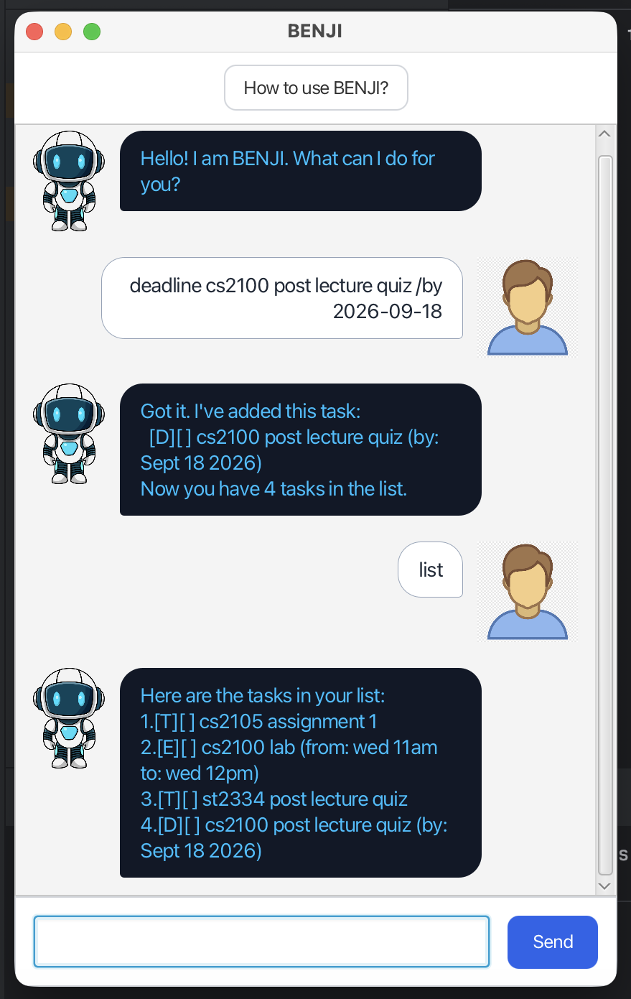

# BENJI User Guide



BENJI is a personal task-management chatbot for keeping track of **to-dos**,
**deadlines**, and **events**. Enter commands in the text field and press
<kbd>Enter</kbd> or select **Send**.

> [!TIP]
> Select **How to use BENJI?** or type `help` to open the in-app command guide.

## Quick start
1. Add a task with `todo read the project brief`.
2. Add a deadline with `deadline submit iP /by 2026-09-25`.
3. Enter `list` to view every task.
4. Complete the first task with `mark 1`.

BENJI saves task-list changes automatically. Your tasks are restored when you
start the application again.

## Command summary

| Command | Purpose |
| --- | --- |
| `todo DESCRIPTION` | Add a to-do task. |
| `deadline DESCRIPTION /by yyyy-MM-dd` | Add a task with a deadline. |
| `event DESCRIPTION /from START /to END` | Add an event with a start and end time. |
| `list` | Show every task. |
| `mark TASK_NUMBER` | Mark a task as completed. |
| `unmark TASK_NUMBER` | Mark a task as incomplete. |
| `delete TASK_NUMBER` | Remove a task. |
| `find KEYWORD` | Show tasks containing a keyword. |
| `help` | Open the command guide. |
| `bye` | Ask BENJI to say goodbye. |

## Managing tasks

### Add a to-do

Use a to-do for a task without a date or time.

```text
todo buy groceries
```

BENJI adds the task as `[T][ ] buy groceries`.

### Add a deadline

Use the date format `yyyy-MM-dd`.

```text
deadline submit report /by 2026-09-25
```

The task is shown with a deadline, for example:

```text
[D][ ] submit report (by: Sep 25 2026)
```

> [!WARNING]
> A deadline must include `/by` followed by a valid date. For example,
> `deadline submit report /by tomorrow` is not accepted.

### Add an event

Use `/from` before `/to`.

```text
event team meeting /from 2pm /to 3pm
```

This creates an event such as:

```text
[E][ ] team meeting (from: 2pm to: 3pm)
```

### View all tasks

```text
list
```

Tasks are numbered. Use those numbers with `mark`, `unmark`, and `delete`.

### Mark or unmark a task

```text
mark 2
unmark 2
```

A completed task has an `X` in its status box:

```text
[T][X] buy groceries
```

### Delete a task

```text
delete 3
```

> [!NOTE]
> Task numbers come from the most recent `list` output. If the number does not
> exist, BENJI explains the problem without changing your task list.

### Find tasks

```text
find report
```

BENJI lists tasks whose text contains `report`.

## Getting help and leaving

### Open the Help guide

Use either of these options:

- Select **How to use BENJI?** at the top of the window.
- Enter `help` in the command field.

### Say goodbye

```text
bye
```

BENJI sends a farewell message. You can then close the application window
normally.

## Common errors

BENJI keeps your task list unchanged when it cannot understand a command.

| Situation | Example | What to do |
| --- | --- | --- |
| Unknown command | `remind me tomorrow` | Use `help` to see accepted commands. |
| Missing to-do description | `todo` | Add a description after `todo`. |
| Invalid deadline date | `deadline essay /by Friday` | Use a date such as `2026-09-25`. |
| Event markers in the wrong order | `event meeting /to 3pm /from 2pm` | Put `/from` before `/to`. |
| Invalid task number | `delete 99` | Run `list` and use one of its numbers. |

## Task status legend

- `[ ]` — not completed
- `[X]` — completed
- `[T]` — to-do
- `[D]` — deadline
- `[E]` — event
